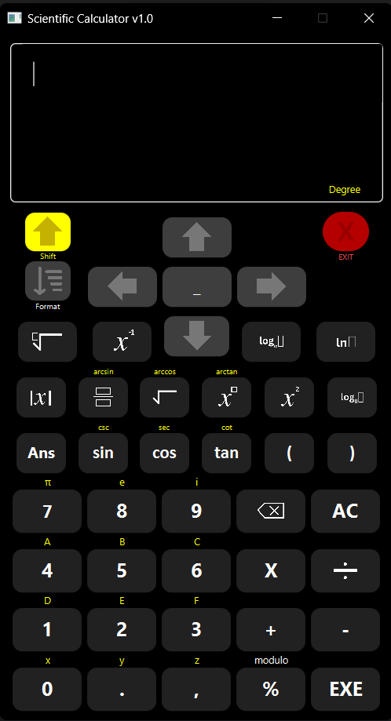

# Scientific Calculator - An OOP Project
Hello, this is my final project for in my OOP course. It's your basic
Scientific Calculator that has nothing new to offer. This was one of the choices
that was offered to us by our professor, and I chose this because it looked fun to code (It was not fun to code).

### What to know?
This application has its mishaps, and if you're using my app,
you may have to work around on some of its missing functionalities, 
if you ever find one, and I'm sure you will. Feel free to clone it
and your neat features into it. Just know that currently, 20th April 2025,
I still am very inexperienced at programming.

### Dependencies
Make sure JavaFX is properly set up in your IDE or build system (like Maven or Gradle) to run the app.
[You can download JavaFX here!](https://openjfx.io)

### 🧰 Maven Setup
Make sure you have Maven installed. If not, [download it from here](https://maven.apache.org)

### 📸 Screenshots

### 🚀 Features
> Note: Cooler functions were supposed to be added, I didn't have enough time to do so.

- Basic arithmetic (Add, Subtract, Multiply, Divide)
- Trigonometric functions (sin, cos, tan)
- Exponents and roots
- Logarithmic functions

### 🧠 Lessons Learned
- I learned how to use OOP Concepts (Polymorphism, Encapsulation, Inheritance, Abstract, Interfaces, etc...), Although still I'm not that good yet, I had fun.
- To take breaks from time to time. My brain can't handle the overwhelming feeling of having to think of the functionalities of my code for more than a few hours. Now I'll remember to take my breaks.

